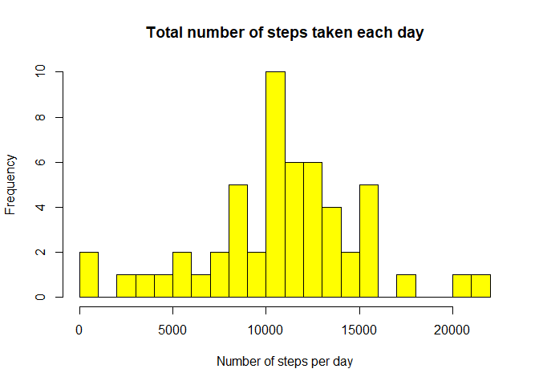
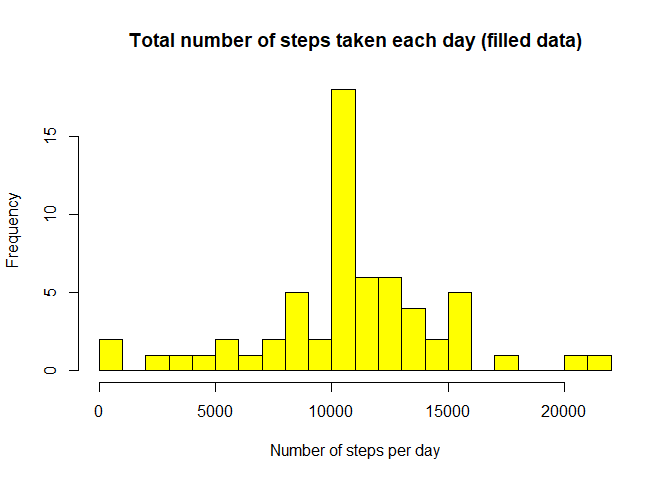
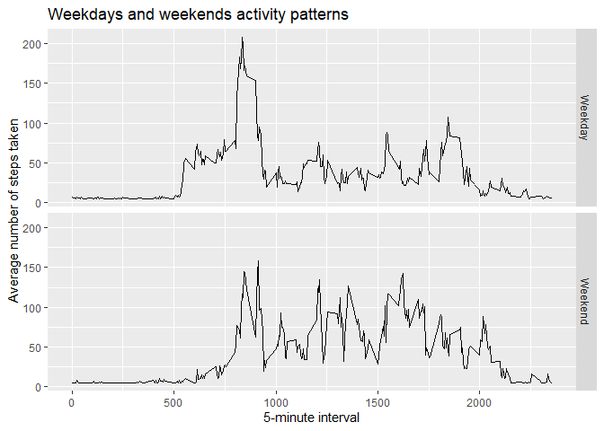

## Loading and preprocessing the data

```r
if(!file.exists("activity.csv")){
  unzip("activity.zip")
}

rdata <- read.csv("activity.csv",header = TRUE)

mdata <- na.omit(rdata)
```
## What is mean total number of steps taken per day?

### Calculate the total number of steps taken per day.

```r
steps_taken_per_day <- aggregate(mdata$steps, by = list(Steps.Date = mdata$date), FUN = "sum")
```
### Make a histogram of the total number of steps taken each day.


```r
hist(steps_taken_per_day$x, col= "yellow",
     breaks = 20,
     main= "Total number of steps taken each day",
     xlab = "Number of steps per day")
```

<!-- -->

### Calculate the mean and median of the total number of steps taken per day.

```r
mean_of_steps <- mean(steps_taken_per_day[,2])
print(mean_of_steps)
```

```
## [1] 10766.19
```

```r
median_of_steps <- median(steps_taken_per_day[,2])
print(median_of_steps)
```

```
## [1] 10765
```
## What is the average daily activity pattern?

### Make a time series plot of the 5-minute interval(x-axis) and the average number of steps taken, average across all days(y-axis).

```r
day_averaged <- aggregate(mdata$steps,
                            by = list(Interval = mdata$interval),
                            FUN = "mean")
plot(day_averaged$Interval, day_averaged$x, type = "l",
     main = "Average daily activity pattern",
     ylab = "Average number of steps taken",
     xlab = "5-minute interval")
```

<!-- -->

### Define the interval with the maximum number of steps

```r
row_intvl <- which.max(day_averaged$x)
max_intvl <- day_averaged[row_intvl,1]
print(max_intvl)
```

```
## [1] 835
```
## Imputing missing values

### Calculate the total number of missing values in the dataset.

```r
num_missing_val <- length(which(is.na(rdata$steps)))
print(num_missing_val)
```

```
## [1] 2304
```
### Use simple 'impute' function in 'Hmisc' package to substitute NA values in the data.

### Create a new dataset that is equal to the original dataset but with the missing data filled in.

```r
library(Hmisc)
```

```
## Loading required package: lattice
```

```
## Loading required package: survival
```

```
## Loading required package: Formula
```

```
## Loading required package: ggplot2
```

```
## 
## Attaching package: 'Hmisc'
```

```
## The following objects are masked from 'package:base':
## 
##     format.pval, units
```

```r
filled_raw_data <- rdata
filled_raw_data$steps <- impute(rdata$steps, fun= mean)
```
### Make a histogram of the total number of steps taken each day with new frequencies of total number of steps after imputing.

```r
steps_per_day_without_na <- aggregate(filled_raw_data$steps,
          by = list(Steps.Date = filled_raw_data$date),
          FUN = "sum")
hist(steps_per_day_without_na$x, col = "yellow",
     breaks = 20,
     main = "Total number of steps taken each day (filled data)",
     xlab = "Number of steps per day")
```

<!-- -->

### Calculate the new mean and median

```r
mean_of_steps_noNA <- mean(steps_per_day_without_na[,2])
print(mean_of_steps_noNA)
```

```
## [1] 10766.19
```

```r
median_of_steps_noNA <-
median(steps_per_day_without_na[,2])
print(median_of_steps_noNA)
```

```
## [1] 10766.19
```
### Based on the new plotted histogram, it is almost same as the histogram plotted before which filling with NA values. After imputing missing values, the median has changed a little bit and became same value with mean.

## Are there differences in activity patterns between weekdays and weekends?

### To answer the question above, craete a new variable in the dataset to indicate whether a given date is a weekday or weekend.

```r
filled_raw_data$date <- as.Date(filled_raw_data$date)
filled_raw_data$weekday <- weekdays(filled_raw_data$date)
filled_raw_data$type_of_day <- ifelse(filled_raw_data$weekday =="Saturday" |
        filled_raw_data$weekday =="Sunday","Weekend", "Weekday" )
filled_raw_data$type_of_day<- factor(filled_raw_data$type_of_day)
```

### To observe the differences in activity patterns between weekdays and weekends, plot the number of steps for all 5-minuute intervals, averaged across weekdays and weekends separately.

```r
type_of_day_data <- aggregate(steps ~ interval + type_of_day, data = filled_raw_data, mean)

library(ggplot2)
ggplot(type_of_day_data, aes(interval, steps))+
  geom_line() +
  facet_grid(type_of_day ~ .) +
  xlab("5-minute interval") +
  ylab("Average number of steps taken") +
  ggtitle("Weekdays and weekends activity patterns")
```

<!-- -->

### Based on the plot above, we can see the peak in morning is higher number of steps on weedays than weekend. Besides that, the number of steps on weekends higher on average during the day.
